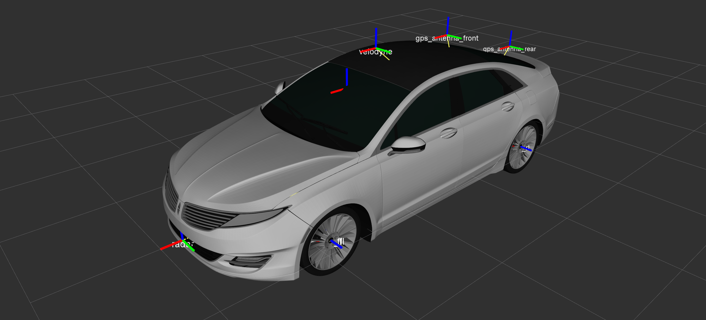

</img>

The repository holds the data required for getting started with the Udacity/Didi self-driving car challenge. To generate tracklets (annotation data) from the released datasets, check out the Docker code in the ```/tracklet``` folder. For sensor transform information, check out ```/mkz-description```.

Please note that tracklets cannot be generated for Dataset 1 without modifying this code, as we added an additional RTK GPS receiver onto the capture vehicle in order to determine orientation. The orientation determination to enable world to capture vehicle transformations on Dataset 2 is currently being written, with a release target for 4/4/2017 EOD.

## Datasets
Here are links to the datasets we've released specifically for this challenge:
* [**Dataset 2**](http://academictorrents.com/details/18d7f6be647eb6d581f5ff61819a11b9c21769c7) – Three different vehicles with a variety of maneuvers, and the Round 1 test seuence. Larger image sizes and two GPS RTK units on the capture vehicle for orientation determination. Velodyne points have been removed to reduce size, so a Velodyne LIDAR driver must be run during bag playback.
* [**Dataset 1**](http://academictorrents.com/details/76352487923a31d47a6029ddebf40d9265e770b5) – NOT SUITABLE FOR TRACKLET GENERATION. Dataset intended for particpants to become familiar with the sensor data format and ROS in general. Tracklet code must be modified to work on this dataset, and no capture vehicle orientation is available unless using Course-Over-Ground techniques.


## Resources
Starting Guides:
* [**Udacity Intro**](docs/GettingStarted.md) – Basic ROS install and displaying data in RVIZ

Here's a list of the projects we've open sourced already that may be helpful:
* [**ROS Examples**](https://github.com/mjshiggins/ros-examples) – Example ROS nodes for consuming/processing the released datasets (work in progress)
* [**Annotated Driving Datasets**](https://github.com/udacity/self-driving-car/tree/master/annotations) – Many hours of labelled driving data
* [**Driving Datasets**](https://github.com/udacity/self-driving-car/tree/master/datasets) – Over 10 hours of driving data (LIDAR, camera frames and more)
