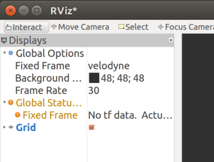
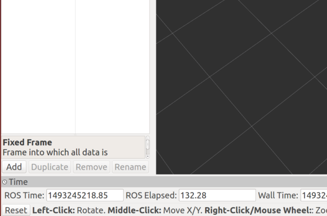
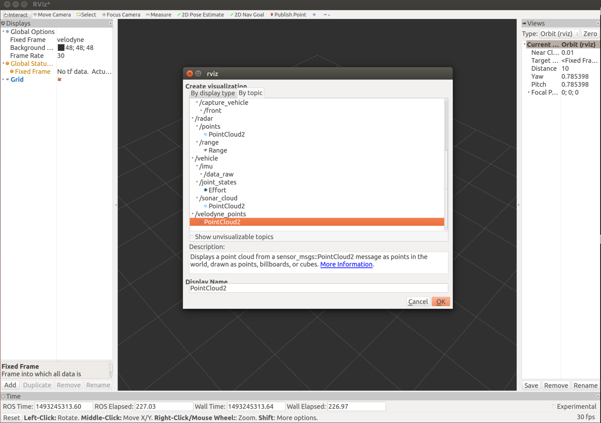
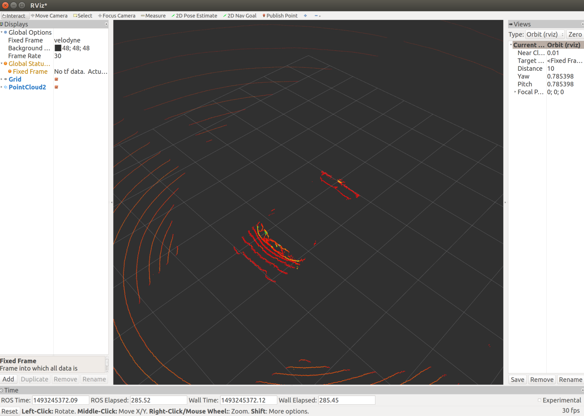

## Getting Started
Whether you’re laser focused on winning $100,000 or just trying to learn the basics of ROS and obstacle detection, there are some basic steps that you’ll need to get started with Udacity’s Didi Challenge.

## Data
The [training dataset](http://academictorrents.com/details/76352487923a31d47a6029ddebf40d9265e770b5)  is available as a ROS bag file. A bag contains the synchronized output of several ROS nodes. For this challenge, each vehicle bag includes:

* Camera video
* Lidar point clouds
* GPS/IMU measurements

There are also obstacle bags which include:

* Front RTK GPS
* Back RTK GPS

## How to Win
In order to win the competition, you must have the most accurate real time system for detecting and locating obstacles in 3D space. The competition defines accuracy as the ratio of correct bounding box volume to the combined volume of any incorrect predictions or missed predictions.

This formula from the challenge’s [GitHub README](https://github.com/udacity/didi-competition/tree/master/tracklets#metrics-and-scoring) is useful:

TP/(TP + FP + FN), where:

True Positives = correctly predicted volume that overlaps ground truth

False Positives = incorrectly predicted volume that does not overlap ground truth

False Negatives = ground truth volume not overlapped by any predictions

## Installing ROS
In order to read the dataset, you’ll need to install ROS. ROS (Robotic Operating System) is an open source set of libraries and tools for working with robots.

To install ROS, you’ll need a computer running Ubuntu. There has been some work on getting ROS running in a Docker container, but there are still a lot of issues with running the visualizations in RVIZ with that setup. If you don’t have a Linux machine already,  consider setting up a [dual boot machine](https://help.ubuntu.com/community/WindowsDualBoot).

This tutorial covers [installing ROS Indigo](http://www.ros.org/install/)  on Ubuntu 14.04. These versions work well with [Autoware](https://github.com/CPFL/Autoware), an open-source self-driving car project built on top of ROS. Later on, Autoware will be useful for camera/LIDAR calibration.  

1. Setup your sources.list
``` bash
 sudo sh -c 'echo "deb http://packages.ros.org/ros/ubuntu $(lsb_release -sc) main" > /etc/apt/sources.list.d/ros-latest.list'
```

2. Set up your keys
``` bash
sudo apt-key adv --keyserver hkp://ha.pool.sks-keyservers.net:80 --recv-key 421C365BD9FF1F717815A3895523BAEEB01FA116
```

3. Install ROS (this will take a few minutes)
``` bash
sudo apt-get install ros-indigo-desktop-full
```

4. Update your rosdep (dependency management tool)
``` bash
sudo rosdep init
rosdep update
```

5. Update `env` variables
``` bash
echo "source /opt/ros/indigo/setup.bash" >> ~/.bashrc
```

## Display Data in RVIZ
Once you’ve installed ROS and downloaded the dataset, you can display the bag files in RVIZ.

First, start the ROS master node by running roscore
``` bash
roscore
```

Next, play the bagfile
``` bash
rosbag play /{path-to-file}/bagfile_name.bag
```

Check that the correct ROS nodes are publishing messages
``` bash
rostopic list

$ rostopic echo /vehicle/gps/fix
```

This should output something like this:
header:
```
  seq: 7318
  stamp:
    secs: 1492883544
    nsecs: 965464774
  frame_id: ''
status:
  status: 0
  service: 1
latitude: 37.4267093333
longitude: -122.07584
altitude: -42.5
position_covariance: [0.0, 0.0, 0.0, 0.0, 0.0, 0.0, 0.0, 0.0, 0.0]
position_covariance_type: 0
```

Start RVIZ to visualize the data being published
``` bash
rviz
```

Switch the Fixed Frame to ‘velodyne’ so that we can show point clouds

</img>

Add the ROS nodes that you want to visualize.

Click the Add button at the bottom of the Displays panel:

</img>

Select the ‘By Topic’ tab and choose the topic that you want to visualize:

</img>

Now you can see the point cloud displayed:

</img>

If you want to display a point cloud, but don't see the /velodyne_points topic in RVIZ, go through the conversion section below to create the topic.

## Convert /velodyne_packets to /velodyne_points
Depending on which dataset you're using, you may find that the bag file is missing the Velodyne point cloud (published on the /velodyne_points ROS topic). This is omitted to reduce the size of the dataset. The LIDAR readings are represented in a compressed packet form (/velodyne_packets). ROS provides a tools for converting between these formats.

Install the Velodyne package for your version of ROS (Indigo in this example)
``` bash
sudo apt-get install ros-indigo-velodyne
```

Run the conversion tool for the HDL-32E LIDAR unit that Udacity used to record the data (you may have a different path to the config file depending on your installation)
``` bash
rosrun velodyne_pointcloud cloud_node _calibration:=/opt/ros/indigo/share/velodyne_pointcloud/params/32db.yaml
```

Now when you play a bag file with the /velodyne_packets topic, it will automatically get converted to a point cloud format and republished as /velodyne_points
